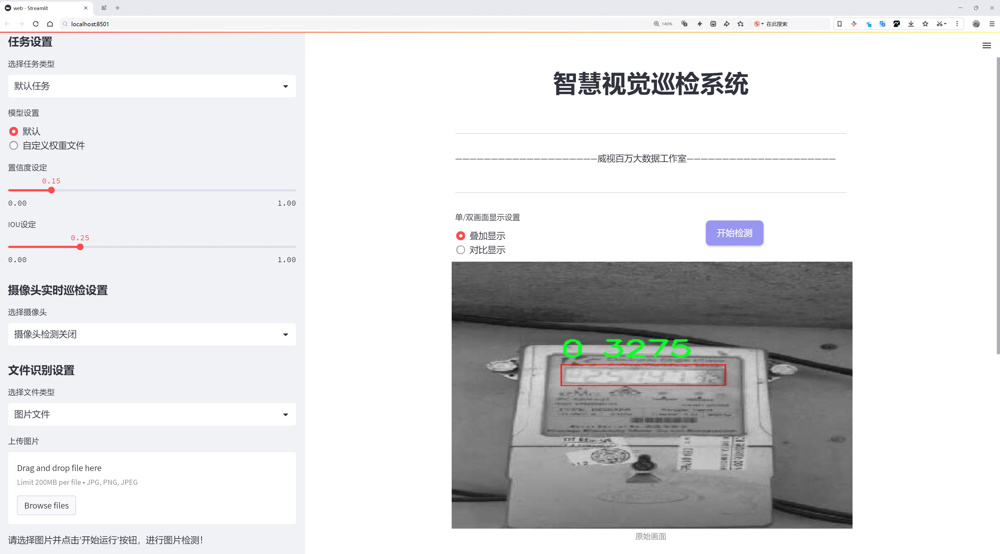
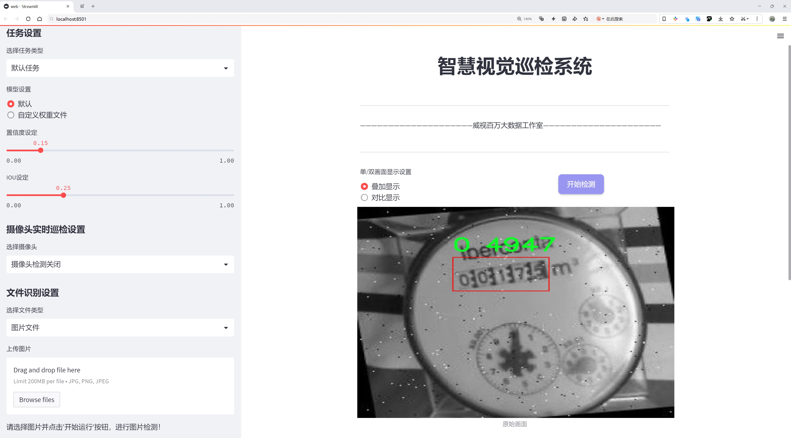
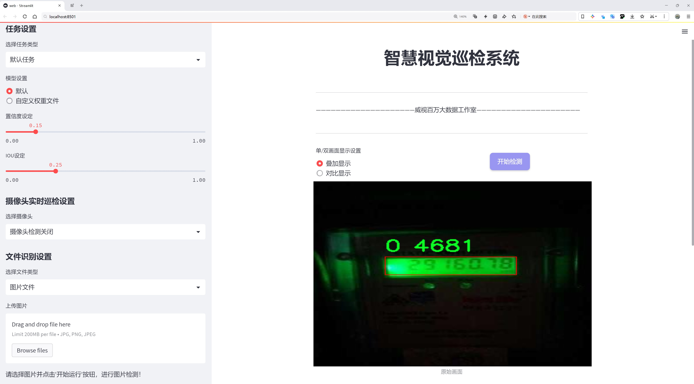
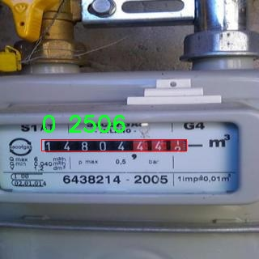
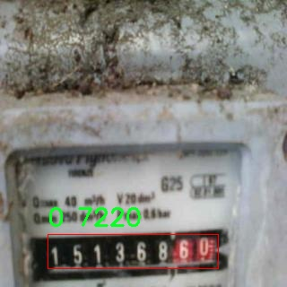
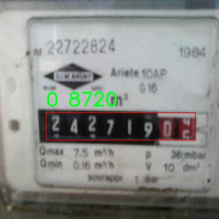
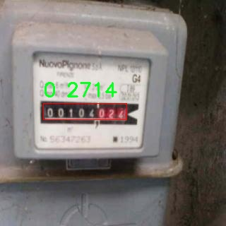
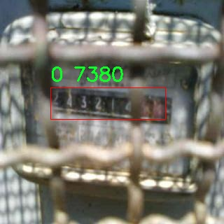

# 仪表盘读数区域检测检测系统源码分享
 # [一条龙教学YOLOV8标注好的数据集一键训练_70+全套改进创新点发刊_Web前端展示]

### 1.研究背景与意义

项目参考[AAAI Association for the Advancement of Artificial Intelligence](https://gitee.com/qunmasj/projects)

项目来源[AACV Association for the Advancement of Computer Vision](https://github.com/qunshansj/good)

研究背景与意义

随着智能化技术的迅猛发展，计算机视觉在各个领域的应用日益广泛，尤其是在工业自动化、智能监控和智能交通等领域，图像识别技术的需求不断增长。仪表盘作为许多设备和车辆的重要组成部分，其读数的准确获取对于设备的正常运行和安全监控至关重要。然而，传统的人工读取方式不仅效率低下，而且容易受到人为因素的影响，导致数据的准确性和可靠性降低。因此，基于深度学习的自动化仪表盘读数检测系统的研究显得尤为重要。

YOLO（You Only Look Once）系列算法因其高效的实时目标检测能力而受到广泛关注。YOLOv8作为该系列的最新版本，结合了更先进的网络结构和训练策略，能够在保证检测精度的同时显著提高处理速度。通过对YOLOv8的改进，可以进一步提升其在复杂环境下的检测性能，尤其是在仪表盘读数的识别上。本文旨在基于改进的YOLOv8算法，构建一个高效的仪表盘读数区域检测系统，以实现对仪表盘信息的快速、准确提取。

本研究所使用的数据集包含3404张图像，专注于仪表盘的读数区域检测。尽管该数据集的类别数量仅为1类，但其丰富的图像样本为模型的训练提供了良好的基础。通过对这些图像的分析和处理，研究者可以提取出仪表盘的特征信息，进而提高目标检测的准确性和鲁棒性。此外，数据集的多样性和复杂性为模型的泛化能力提供了挑战，推动了对YOLOv8算法的进一步优化。

本研究的意义不仅在于技术层面的创新，更在于其实际应用价值。通过构建高效的仪表盘读数检测系统，可以在多个领域实现自动化监控与数据采集，降低人工成本，提高工作效率。例如，在汽车行业，该系统可以实时监测车辆的运行状态，及时反馈给驾驶员，确保行车安全；在工业生产中，仪表盘的自动检测可以实现设备的实时监控，预防故障发生，提升生产效率。此外，该系统的成功应用还将为其他领域的目标检测提供借鉴，推动相关技术的发展。

综上所述，基于改进YOLOv8的仪表盘读数区域检测系统的研究，不仅具有重要的理论意义，还具有广泛的实际应用前景。通过对该系统的深入研究与开发，期望能够为智能化设备的普及和应用提供有力支持，推动相关技术的进步与发展。

### 2.图片演示







##### 注意：由于此博客编辑较早，上面“2.图片演示”和“3.视频演示”展示的系统图片或者视频可能为老版本，新版本在老版本的基础上升级如下：（实际效果以升级的新版本为准）

  （1）适配了YOLOV8的“目标检测”模型和“实例分割”模型，通过加载相应的权重（.pt）文件即可自适应加载模型。

  （2）支持“图片识别”、“视频识别”、“摄像头实时识别”三种识别模式。

  （3）支持“图片识别”、“视频识别”、“摄像头实时识别”三种识别结果保存导出，解决手动导出（容易卡顿出现爆内存）存在的问题，识别完自动保存结果并导出到tempDir中。

  （4）支持Web前端系统中的标题、背景图等自定义修改，后面提供修改教程。

  另外本项目提供训练的数据集和训练教程,暂不提供权重文件（best.pt）,需要您按照教程进行训练后实现图片演示和Web前端界面演示的效果。

### 3.视频演示

[3.1 视频演示](https://www.bilibili.com/video/BV1QypYehEHf/)

### 4.数据集信息展示

##### 4.1 本项目数据集详细数据（类别数＆类别名）

nc: 1
names: ['0']


##### 4.2 本项目数据集信息介绍

数据集信息展示

在本研究中，我们使用了名为“Meter dial”的数据集，旨在改进YOLOv8的仪表盘读数区域检测系统。该数据集专注于仪表盘的读数识别，尤其是在各种环境和条件下的表现。数据集的设计考虑到了仪表盘的多样性和复杂性，确保了模型在实际应用中的有效性和鲁棒性。

“Meter dial”数据集包含了一个类别，具体为仪表盘读数区域，类别数量设定为1，命名为‘0’。这一类别的设定使得模型能够专注于识别和检测仪表盘上的读数区域，而不被其他不相关的元素干扰。通过这样的设计，数据集能够提供清晰的标注，帮助模型在训练过程中有效学习到仪表盘读数的特征。

数据集的构建过程包括收集和标注大量的仪表盘图像，这些图像来自不同类型的仪表盘，如汽车仪表、工业设备显示器等。每张图像都经过精心标注，确保读数区域的准确性和一致性。这种高质量的标注不仅提高了数据集的可信度，也为后续的模型训练提供了坚实的基础。

在数据集的多样性方面，“Meter dial”涵盖了不同的光照条件、视角和背景，确保模型在各种环境下的适应能力。例如，数据集中包含了在强光、弱光以及不同反射条件下拍摄的仪表盘图像，这使得模型能够学习到如何在不同的视觉条件下准确识别读数区域。此外，数据集还考虑到了仪表盘的不同样式和设计，使得模型能够处理多种类型的仪表盘，而不仅限于某一特定样式。

为了进一步增强模型的泛化能力，数据集还进行了数据增强处理，包括旋转、缩放、翻转等操作。这些增强技术不仅增加了数据集的多样性，还帮助模型在面对未见过的样本时，能够更好地进行推理和判断。

在训练过程中，使用“Meter dial”数据集的目标是提升YOLOv8在仪表盘读数区域检测任务中的性能。通过充分利用该数据集的特性，模型能够学习到更为精准的特征表示，从而提高检测的准确性和效率。我们期望，通过对该数据集的深入研究和应用，能够推动仪表盘读数检测技术的发展，为相关领域的自动化和智能化提供有力支持。

总之，“Meter dial”数据集不仅为YOLOv8的训练提供了必要的数据支持，还通过其独特的设计和多样性，确保了模型在实际应用中的有效性。随着研究的深入，我们相信该数据集将为仪表盘读数区域检测系统的改进和优化提供重要的参考和借鉴。











### 5.全套项目环境部署视频教程（零基础手把手教学）

[5.1 环境部署教程链接（零基础手把手教学）](https://www.ixigua.com/7404473917358506534?logTag=c807d0cbc21c0ef59de5)


[5.2 安装Python虚拟环境创建和依赖库安装视频教程链接（零基础手把手教学）](https://www.ixigua.com/7404474678003106304?logTag=1f1041108cd1f708b01a)

### 6.手把手YOLOV8训练视频教程（零基础小白有手就能学会）

[6.1 环境部署教程链接（零基础手把手教学）](https://www.ixigua.com/7404477157818401292?logTag=d31a2dfd1983c9668658)

### 7.70+种全套YOLOV8创新点代码加载调参视频教程（一键加载写好的改进模型的配置文件）

[7.1 环境部署教程链接（零基础手把手教学）](https://www.ixigua.com/7404478314661806627?logTag=29066f8288e3f4eea3a4)

### 8.70+种全套YOLOV8创新点原理讲解（非科班也可以轻松写刊发刊，V10版本正在科研待更新）

由于篇幅限制，每个创新点的具体原理讲解就不一一展开，具体见下列网址中的创新点对应子项目的技术原理博客网址【Blog】：


[8.1 70+种全套YOLOV8创新点原理讲解链接](https://gitee.com/qunmasj/good)

### 9.系统功能展示（检测对象为举例，实际内容以本项目数据集为准）

图9.1.系统支持检测结果表格显示

  图9.2.系统支持置信度和IOU阈值手动调节

  图9.3.系统支持自定义加载权重文件best.pt(需要你通过步骤5中训练获得)

  图9.4.系统支持摄像头实时识别

  图9.5.系统支持图片识别

  图9.6.系统支持视频识别

  图9.7.系统支持识别结果文件自动保存

  图9.8.系统支持Excel导出检测结果数据


### 10.原始YOLOV8算法原理

原始YOLOv8算法原理

YOLOv8作为YOLO系列的最新成员，标志着目标检测领域的一次重要飞跃。相较于其前身YOLOv5，YOLOv8在检测精度和速度上均实现了显著的提升，展现出更为卓越的性能。其设计理念围绕着快速、准确和易于使用的目标检测展开，适用于广泛的应用场景，包括图像分割和图像分类等任务。

YOLOv8的网络结构可以分为四个主要部分：输入端、骨干网络、颈部网络和头部网络。输入端的设计考虑了数据增强和自适应处理，采用了马赛克数据增强技术，以提高模型对不同场景的适应能力。具体而言，马赛克增强通过将四张不同的图像随机缩放并拼接成一张新图像，迫使模型学习不同的目标位置和周围环境，从而有效提升了模型的预测精度。此外，YOLOv8在处理输入图像时采用自适应缩放策略，将长边按比例缩小到指定尺寸，并对短边进行填充，旨在减少信息冗余并提高推理速度。

在骨干网络部分，YOLOv8引入了C2f模块，这一模块的设计灵感来源于YOLOv7的ELAN结构。C2f模块通过并行化多个梯度流分支，显著增强了特征提取的能力，形成了一个更为丰富的梯度流。这种结构不仅提高了特征表示能力，还在保持轻量化的同时提升了模型的整体性能。相较于YOLOv5中的C3模块，C2f模块在处理不同规模的模型时调整了通道数，使得模型在精度和速度之间取得了更好的平衡。

颈部网络采用了路径聚合网络（PAN）结构，这一设计旨在加强对不同缩放尺度对象的特征融合能力。通过对特征进行有效的聚合，YOLOv8能够更好地捕捉到目标物体的多样性，提升了模型在复杂场景下的表现。颈部网络的改进，使得YOLOv8在处理多尺度目标时表现得更加灵活和高效。

头部网络的设计是YOLOv8的另一大亮点。YOLOv8将分类和检测过程进行了有效的解耦，采用了Decoupled-Head结构，分别处理分类和边界框回归任务。这一结构的变化使得模型在训练和推理过程中能够更好地聚焦于目标检测的关键点。YOLOv8在损失计算方面引入了新的策略，采用了Task-Aligned Assigner分配策略，依据分类与回归的分数加权结果选择正样本，确保了模型在训练时的高效性。

在损失函数的设计上，YOLOv8结合了二元交叉熵损失（BCELoss）和分布焦点损失（DFLoss）与完全交并比损失（CIOULoss），以提升模型对边界框预测的精准性。这种综合性的损失计算方式，使得YOLOv8在处理目标检测任务时，能够快速聚焦于标签附近的数值，从而提升了检测的准确度。

值得一提的是，YOLOv8在检测框架上抛弃了传统的Anchor-Based方法，转而采用Anchor-Free的策略。这一转变不仅简化了模型的结构，还提升了其泛化能力。Anchor-Free方法将目标检测转化为关键点检测，避免了在训练前对数据集进行复杂的聚类分析，减少了计算复杂度。这种灵活性使得YOLOv8能够在不同数据集和场景下表现出色，适应性更强。

总的来说，YOLOv8通过对网络结构的优化、损失函数的改进以及检测策略的创新，展现出了一种全新的目标检测思路。其在各个方面的提升，使得YOLOv8不仅在精度上达到了新的高度，也在速度上实现了更快的推理能力。无论是在实时性要求高的应用场景，还是在需要高精度检测的任务中，YOLOv8都展现出了其强大的竞争力和广泛的应用潜力。随着YOLOv8的推广和应用，目标检测技术的未来将更加光明，推动着智能视觉系统的不断进步。


### 11.项目核心源码讲解（再也不用担心看不懂代码逻辑）

#### 11.1 ultralytics\models\rtdetr\__init__.py

下面是对给定代码的核心部分进行提炼和详细注释的结果：

```python
# Ultralytics YOLO 🚀, AGPL-3.0 license

# 从当前包中导入 RTDETR 模型类
from .model import RTDETR

# 从当前包中导入 RTDETR 预测器类
from .predict import RTDETRPredictor

# 从当前包中导入 RTDETR 验证器类
from .val import RTDETRValidator

# 定义模块的公共接口，包含 RTDETR 预测器、验证器和模型
__all__ = "RTDETRPredictor", "RTDETRValidator", "RTDETR"
```

### 代码分析与注释：

1. **导入模块**：
   - `from .model import RTDETR`：从当前包的 `model` 模块中导入 `RTDETR` 类，该类通常用于定义目标检测模型的结构和功能。
   - `from .predict import RTDETRPredictor`：从当前包的 `predict` 模块中导入 `RTDETRPredictor` 类，该类负责使用训练好的模型进行预测，通常包括图像输入和输出结果的处理。
   - `from .val import RTDETRValidator`：从当前包的 `val` 模块中导入 `RTDETRValidator` 类，该类用于验证模型的性能，通常涉及到评估指标的计算和结果的可视化。

2. **定义公共接口**：
   - `__all__ = "RTDETRPredictor", "RTDETRValidator", "RTDETR"`：这是一个特殊的变量，用于定义当使用 `from module import *` 时，哪些名称会被导入。这里定义了三个核心组件，确保用户在使用该模块时能够直接访问到这三个重要的类。

通过这些核心部分的提炼和注释，可以更清晰地理解该代码的结构和功能。

这个文件是一个Python模块的初始化文件，位于`ultralytics/models/rtdetr`目录下。它的主要作用是定义该模块的公共接口，方便其他模块或文件进行导入和使用。

首先，文件顶部的注释表明这个项目是Ultralytics YOLO的一部分，并且使用的是AGPL-3.0许可证。这说明该项目遵循开源协议，允许用户自由使用、修改和分发代码，但也要求在分发时遵循相同的许可证条款。

接下来，文件通过`from .model import RTDETR`、`from .predict import RTDETRPredictor`和`from .val import RTDETRValidator`这三行代码，从同一目录下的不同模块中导入了三个类或函数。这些导入的对象分别是RTDETR模型、RTDETR预测器和RTDETR验证器。这意味着在使用这个模块时，用户可以直接访问这些导入的类或函数，而不需要关心它们具体的实现细节。

最后，`__all__`变量被定义为一个元组，包含了三个字符串："RTDETRPredictor"、"RTDETRValidator"和"RTDETR"。这个变量的作用是指定当使用`from module import *`语句时，哪些对象会被导入。通过定义`__all__`，模块的作者可以控制哪些部分是公共的，哪些部分是内部实现，不希望被外部直接访问的。

总的来说，这个初始化文件通过导入必要的组件并定义公共接口，为RTDETR模型的使用提供了便利，使得用户能够方便地进行模型的预测和验证。

#### 11.2 ultralytics\utils\plotting.py

以下是代码中最核心的部分，并附上详细的中文注释：

```python
class Colors:
    """
    Ultralytics 默认颜色调色板类，提供颜色相关的功能。
    """

    def __init__(self):
        """初始化颜色调色板，使用十六进制颜色值转换为RGB格式。"""
        hexs = (
            "FF3838", "FF9D97", "FF701F", "FFB21D", "CFD231",
            "48F90A", "92CC17", "3DDB86", "1A9334", "00D4BB",
            "2C99A8", "00C2FF", "344593", "6473FF", "0018EC",
            "8438FF", "520085", "CB38FF", "FF95C8", "FF37C7",
        )
        # 将十六进制颜色转换为RGB格式并存储
        self.palette = [self.hex2rgb(f"#{c}") for c in hexs]
        self.n = len(self.palette)  # 颜色数量
        # 定义特定的颜色调色板
        self.pose_palette = np.array(
            [
                [255, 128, 0], [255, 153, 51], [255, 178, 102],
                [230, 230, 0], [255, 153, 255], [153, 204, 255],
                [255, 102, 255], [255, 51, 255], [102, 178, 255],
                [51, 153, 255], [255, 153, 153], [255, 102, 102],
                [255, 51, 51], [153, 255, 153], [102, 255, 102],
                [51, 255, 51], [0, 255, 0], [0, 0, 255],
                [255, 0, 0], [255, 255, 255],
            ],
            dtype=np.uint8,
        )

    def __call__(self, i, bgr=False):
        """根据索引返回RGB颜色，支持BGR格式转换。"""
        c = self.palette[int(i) % self.n]  # 获取颜色
        return (c[2], c[1], c[0]) if bgr else c  # 返回BGR或RGB格式

    @staticmethod
    def hex2rgb(h):
        """将十六进制颜色转换为RGB格式。"""
        return tuple(int(h[1 + i : 1 + i + 2], 16) for i in (0, 2, 4))


class Annotator:
    """
    用于图像注释的类，支持绘制边框、文本、关键点等。
    """

    def __init__(self, im, line_width=None, font_size=None, font="Arial.ttf", pil=False, example="abc"):
        """初始化Annotator类，设置图像、线宽、字体等属性。"""
        assert im.data.contiguous, "图像数据不连续，请使用np.ascontiguousarray(im)处理输入图像。"
        non_ascii = not is_ascii(example)  # 检查是否为非ASCII字符
        self.pil = pil or non_ascii  # 根据条件选择使用PIL或cv2
        self.lw = line_width or max(round(sum(im.shape) / 2 * 0.003), 2)  # 计算线宽
        if self.pil:  # 使用PIL
            self.im = im if isinstance(im, Image.Image) else Image.fromarray(im)
            self.draw = ImageDraw.Draw(self.im)  # 创建绘图对象
            try:
                font = check_font("Arial.Unicode.ttf" if non_ascii else font)  # 检查字体
                size = font_size or max(round(sum(self.im.size) / 2 * 0.035), 12)  # 计算字体大小
                self.font = ImageFont.truetype(str(font), size)  # 加载字体
            except Exception:
                self.font = ImageFont.load_default()  # 加载默认字体
        else:  # 使用cv2
            self.im = im if im.flags.writeable else im.copy()  # 确保图像可写
            self.tf = max(self.lw - 1, 1)  # 字体厚度
            self.sf = self.lw / 3  # 字体缩放

    def box_label(self, box, label="", color=(128, 128, 128), txt_color=(255, 255, 255), rotated=False):
        """在图像上绘制边框和标签。"""
        if isinstance(box, torch.Tensor):
            box = box.tolist()  # 转换为列表
        if self.pil or not is_ascii(label):  # 使用PIL或非ASCII标签
            if rotated:
                self.draw.polygon([tuple(b) for b in box], width=self.lw, outline=color)  # 绘制多边形
            else:
                self.draw.rectangle(box, width=self.lw, outline=color)  # 绘制矩形
            if label:
                w, h = self.font.getsize(label)  # 获取文本宽高
                p1 = (box[0], box[1])  # 确定文本位置
                outside = p1[1] - h >= 0  # 检查文本是否在框外
                self.draw.rectangle(
                    (p1[0], p1[1] - h if outside else p1[1], p1[0] + w + 1, p1[1] + 1 if outside else p1[1] + h + 1),
                    fill=color,
                )  # 绘制文本背景
                self.draw.text((p1[0], p1[1] - h if outside else p1[1]), label, fill=txt_color, font=self.font)  # 绘制文本
        else:  # 使用cv2
            p1, p2 = (int(box[0]), int(box[1])), (int(box[2]), int(box[3]))  # 确定矩形的两个角点
            cv2.rectangle(self.im, p1, p2, color, thickness=self.lw, lineType=cv2.LINE_AA)  # 绘制矩形
            if label:
                w, h = cv2.getTextSize(label, 0, fontScale=self.sf, thickness=self.tf)[0]  # 获取文本宽高
                outside = p1[1] - h >= 3  # 检查文本是否在框外
                p2 = p1[0] + w, p1[1] - h - 3 if outside else p1[1] + h + 3  # 确定文本背景位置
                cv2.rectangle(self.im, p1, p2, color, -1, cv2.LINE_AA)  # 绘制文本背景
                cv2.putText(self.im, label, (p1[0], p1[1] - 2 if outside else p1[1] + h + 2), 0, self.sf, txt_color, thickness=self.tf, lineType=cv2.LINE_AA)  # 绘制文本

    def result(self):
        """返回注释后的图像数组。"""
        return np.asarray(self.im)
```

以上代码中包含了`Colors`和`Annotator`类的核心部分。`Colors`类用于处理颜色调色板，`Annotator`类用于在图像上绘制边框、文本和其他注释。每个方法都附有详细的中文注释，解释其功能和实现细节。

这个程序文件 `ultralytics/utils/plotting.py` 是一个用于图像处理和可视化的工具库，主要用于与 Ultralytics YOLO（You Only Look Once）模型相关的任务。该文件包含多个类和函数，主要功能包括颜色处理、图像注释、绘制标签、保存图像裁剪、绘制结果等。

首先，文件定义了一个 `Colors` 类，用于管理颜色调色板。该类提供了将十六进制颜色代码转换为 RGB 值的方法，并初始化了一组预定义的颜色和特定的姿态调色板。

接下来是 `Annotator` 类，它用于在图像上绘制注释。该类支持使用 PIL 或 OpenCV 绘制，包括绘制边框、文本、关键点、掩膜等。`Annotator` 类的构造函数接收图像、线宽、字体等参数，并根据这些参数设置绘图环境。该类中有多个方法，如 `box_label` 用于绘制边框和标签，`masks` 用于绘制掩膜，`kpts` 用于绘制关键点，`rectangle` 和 `text` 用于绘制矩形和文本。

此外，文件中还定义了一些用于绘制和保存图像的函数。例如，`plot_labels` 函数用于绘制训练标签，包括类直方图和框统计信息。`save_one_box` 函数用于根据给定的边界框从图像中裁剪并保存图像。`plot_images` 函数用于绘制图像网格并添加标签，支持绘制边界框、关键点和掩膜。

文件还提供了 `plot_results` 函数，用于从 CSV 文件中绘制训练结果，支持分割、姿态估计和分类等多种数据类型。`plt_color_scatter` 函数用于绘制基于 2D 直方图的散点图，`plot_tune_results` 函数用于绘制超参数调优结果。

最后，文件中还有一些用于将模型输出转换为目标格式的函数，如 `output_to_target` 和 `output_to_rotated_target`，以及用于可视化特征图的 `feature_visualization` 函数。

整体而言，这个文件提供了一系列强大的工具，用于图像处理、可视化和分析，适用于计算机视觉任务，尤其是与 YOLO 模型相关的应用。

#### 11.3 ui.py

```python
import sys
import subprocess

def run_script(script_path):
    """
    使用当前 Python 环境运行指定的脚本。

    Args:
        script_path (str): 要运行的脚本路径

    Returns:
        None
    """
    # 获取当前 Python 解释器的路径
    python_path = sys.executable

    # 构建运行命令
    command = f'"{python_path}" -m streamlit run "{script_path}"'

    # 执行命令
    result = subprocess.run(command, shell=True)
    if result.returncode != 0:
        print("脚本运行出错。")


# 实例化并运行应用
if __name__ == "__main__":
    # 指定您的脚本路径
    script_path = "web.py"  # 这里可以直接指定脚本路径

    # 运行脚本
    run_script(script_path)
```

### 代码注释说明：

1. **导入模块**：
   - `import sys`：导入系统相关的模块，用于获取当前 Python 解释器的路径。
   - `import subprocess`：导入子进程模块，用于在 Python 中执行外部命令。

2. **定义 `run_script` 函数**：
   - 该函数接受一个参数 `script_path`，表示要运行的 Python 脚本的路径。
   - 使用 `sys.executable` 获取当前 Python 解释器的路径，以确保脚本在当前环境中运行。
   - 构建命令字符串 `command`，该命令使用 `streamlit` 模块运行指定的脚本。
   - 使用 `subprocess.run` 执行构建的命令，并通过 `shell=True` 允许在 shell 中执行。
   - 检查命令的返回码，如果不为 0，表示脚本运行出错，打印错误信息。

3. **主程序块**：
   - `if __name__ == "__main__":`：确保该代码块仅在直接运行脚本时执行，而不是作为模块导入时执行。
   - 指定要运行的脚本路径 `script_path`，这里直接指定为 `"web.py"`。
   - 调用 `run_script` 函数，传入脚本路径以执行该脚本。

这个程序文件的主要功能是通过当前的 Python 环境来运行一个指定的脚本，具体是使用 Streamlit 来启动一个 Web 应用。首先，程序导入了必要的模块，包括 `sys`、`os` 和 `subprocess`，以及一个自定义的路径处理函数 `abs_path`。

在 `run_script` 函数中，首先获取当前 Python 解释器的路径，这样可以确保使用的是正确的 Python 环境。接着，构建一个命令字符串，该命令会调用 Streamlit 来运行指定的脚本。这里使用了 `-m streamlit run` 来执行脚本，这意味着会通过 Streamlit 模块来启动 Web 应用。

然后，使用 `subprocess.run` 方法来执行构建好的命令。这个方法会在一个新的 shell 中运行命令，并等待其完成。如果命令执行后返回的状态码不为零，说明脚本运行过程中出现了错误，程序会打印出相应的错误信息。

在文件的最后部分，使用 `if __name__ == "__main__":` 语句来确保只有在直接运行该文件时才会执行后面的代码。在这里，指定了要运行的脚本路径，即 `web.py`，并调用 `run_script` 函数来启动这个脚本。

总的来说，这个程序的目的是提供一个简单的接口来运行 Streamlit 应用，确保使用当前的 Python 环境，并处理可能出现的错误。

#### 11.4 train.py

以下是经过简化并添加详细中文注释的核心代码部分：

```python
import os
import torch
import yaml
from ultralytics import YOLO  # 导入YOLO模型库
from QtFusion.path import abs_path  # 导入路径处理函数

# 设置设备为GPU（如果可用），否则使用CPU
device = "0" if torch.cuda.is_available() else "cpu"

if __name__ == '__main__':  # 确保该模块被直接运行时才执行以下代码
    workers = 1  # 设置数据加载的工作进程数
    batch = 2    # 设置每个批次的大小

    data_name = "data"  # 数据集名称
    # 获取数据集配置文件的绝对路径
    data_path = abs_path(f'datasets/{data_name}/{data_name}.yaml', path_type='current')
    unix_style_path = data_path.replace(os.sep, '/')  # 将路径转换为Unix风格

    # 获取数据集目录路径
    directory_path = os.path.dirname(unix_style_path)
    
    # 读取YAML格式的数据集配置文件
    with open(data_path, 'r') as file:
        data = yaml.load(file, Loader=yaml.FullLoader)
    
    # 如果配置文件中有'path'项，则修改为数据集目录路径
    if 'path' in data:
        data['path'] = directory_path
        # 将修改后的数据写回YAML文件
        with open(data_path, 'w') as file:
            yaml.safe_dump(data, file, sort_keys=False)

    # 加载YOLOv8模型配置
    model = YOLO(model='./ultralytics/cfg/models/v8/yolov8s.yaml', task='detect')
    
    # 开始训练模型
    results2 = model.train(
        data=data_path,  # 指定训练数据的配置文件路径
        device=device,  # 指定使用的设备（GPU或CPU）
        workers=workers,  # 指定数据加载的工作进程数
        imgsz=640,  # 指定输入图像的大小为640x640
        epochs=100,  # 指定训练的轮数为100
        batch=batch,  # 指定每个批次的大小
        name='train_v8_' + data_name  # 指定训练任务的名称
    )
```

### 代码注释说明：
1. **导入必要的库**：引入了处理文件、深度学习和YAML文件的库。
2. **设备选择**：根据是否有可用的GPU来选择训练设备。
3. **数据集路径处理**：通过`abs_path`函数获取数据集的配置文件路径，并转换为Unix风格的路径。
4. **读取和修改YAML文件**：读取数据集的配置文件，修改其中的路径项，并将修改后的内容写回文件。
5. **模型加载与训练**：加载YOLOv8模型，并开始训练，指定训练所需的参数，包括数据路径、设备、工作进程数、图像大小、训练轮数和批次大小。

该程序文件 `train.py` 是一个用于训练 YOLOv8 模型的脚本。首先，程序导入了必要的库，包括 `os`、`torch`、`yaml` 和 `ultralytics` 中的 YOLO 模型。接着，程序会根据当前系统是否支持 CUDA 来选择使用 GPU 还是 CPU 进行训练。

在 `if __name__ == '__main__':` 这一块代码中，首先定义了一些训练参数，包括工作进程数 `workers` 和批次大小 `batch`。接下来，程序设置了数据集的名称，并构建了数据集 YAML 文件的绝对路径。使用 `abs_path` 函数获取数据集路径后，程序将路径中的分隔符统一为 Unix 风格的斜杠。

程序随后获取数据集目录的路径，并打开 YAML 文件读取数据。读取后，程序检查 YAML 数据中是否包含 `path` 项，如果有，则将其修改为数据集的目录路径，并将修改后的数据写回 YAML 文件，以确保后续训练能够正确找到数据集。

接下来，程序加载了预训练的 YOLOv8 模型，指定了模型的配置文件。然后，调用 `model.train()` 方法开始训练模型。在训练过程中，程序指定了训练数据的配置文件路径、设备、工作进程数、输入图像的大小（640x640）、训练的 epoch 数（100）以及训练任务的名称。

总体来说，该脚本的功能是设置训练环境，准备数据集，并启动 YOLOv8 模型的训练过程。

#### 11.5 ultralytics\models\utils\__init__.py

以下是对给定代码的核心部分进行保留和详细注释的版本：

```python
# Ultralytics YOLO 🚀, AGPL-3.0 license

# 该代码是Ultralytics YOLO（You Only Look Once）模型的一个实现，YOLO是一种用于目标检测的深度学习模型。
# 该模型的主要特点是速度快、精度高，适用于实时目标检测任务。

# 下面是YOLO模型的核心部分（伪代码示例）：

class YOLO:
    def __init__(self, model_path):
        # 初始化YOLO模型
        # model_path: 预训练模型的路径
        self.model = self.load_model(model_path)  # 加载模型

    def load_model(self, model_path):
        # 加载预训练的YOLO模型
        # 这里可以使用深度学习框架（如PyTorch、TensorFlow等）来加载模型
        pass

    def detect(self, image):
        # 对输入图像进行目标检测
        # image: 输入的图像数据
        detections = self.model.predict(image)  # 使用模型进行预测
        return detections  # 返回检测结果

# 使用示例
if __name__ == "__main__":
    yolo = YOLO("path/to/model")  # 创建YOLO对象并加载模型
    image = "path/to/image.jpg"  # 输入图像路径
    results = yolo.detect(image)  # 进行目标检测
    print(results)  # 输出检测结果
```

### 注释说明：
1. **类定义**：`class YOLO` 定义了一个YOLO类，用于封装YOLO模型的相关功能。
2. **初始化方法**：`__init__` 方法用于初始化YOLO模型，接收模型路径并加载模型。
3. **加载模型**：`load_model` 方法负责加载预训练的YOLO模型，具体实现依赖于所使用的深度学习框架。
4. **目标检测方法**：`detect` 方法接受一张图像并使用模型进行目标检测，返回检测结果。
5. **使用示例**：在主程序中创建YOLO对象，加载模型，并对指定图像进行检测，最后输出检测结果。

以上代码展示了YOLO模型的基本结构和功能，适合用于目标检测任务。

这个文件是Ultralytics YOLO项目的一部分，文件名为`__init__.py`，通常用于标识一个目录为Python包。文件的开头包含了一行注释，说明该项目是Ultralytics YOLO，并且采用AGPL-3.0许可证。

AGPL-3.0许可证是一种开源许可证，允许用户自由使用、修改和分发软件，但要求在分发时必须提供源代码，并且如果对软件进行了修改，必须在同样的许可证下发布修改后的版本。这意味着任何使用这个YOLO模型的项目，若进行分发，都需要遵循相同的开源原则。

虽然在这个片段中没有具体的代码实现，但通常在`__init__.py`文件中，可能会包含包的初始化代码，导入模块或类，或者定义一些公共接口，使得在导入这个包时，可以方便地访问其功能。

总的来说，这个文件是Ultralytics YOLO库的一个重要组成部分，确保了该库可以作为一个完整的Python包被使用，同时也遵循了开源的法律框架。

#### 11.6 ultralytics\models\sam\modules\__init__.py

以下是代码的核心部分，并附上详细的中文注释：

```python
# Ultralytics YOLO 🚀, AGPL-3.0 license

# 该行代码是一个版权声明，表示该代码是由Ultralytics开发的YOLO（You Only Look Once）模型的实现。
# YOLO是一种用于目标检测的深度学习模型，能够实时识别图像中的多个对象。
# AGPL-3.0许可证表示该代码的使用和分发需要遵循该许可证的条款。
```

在这段代码中，最核心的部分是版权声明和许可证信息。它们表明了代码的来源和使用条件。YOLO模型的实现通常包括训练、推理和评估等功能，但在这段代码中没有提供具体的实现细节。

这个程序文件的文件名是 `__init__.py`，位于 `ultralytics\models\sam\modules` 目录下。根据文件名和路径，我们可以推测这个文件是一个 Python 包的一部分，通常用于初始化一个模块或包。

文件的开头有一行注释 `# Ultralytics YOLO 🚀, AGPL-3.0 license`，这表明这个项目与 Ultralytics 的 YOLO（You Only Look Once）系列模型有关。YOLO 是一种广泛使用的目标检测算法，能够在图像中快速而准确地识别和定位物体。注释中提到的 AGPL-3.0 许可证是一种开源许可证，允许用户自由使用、修改和分发代码，但要求在分发修改后的代码时也必须保持相同的许可证。

虽然这个文件的具体代码内容没有给出，但通常情况下，`__init__.py` 文件的作用是将包含它的目录标识为一个 Python 包。这意味着可以在其他 Python 文件中导入这个包，并使用其中定义的类、函数或变量。这个文件可能还会包含一些初始化代码，或者导入其他模块以便于使用。

总的来说，这个文件是 Ultralytics YOLO 项目的一部分，负责将相关模块组织成一个可导入的包，并遵循开源许可证的规定。

### 12.系统整体结构（节选）

### 整体功能和构架概括

该项目是基于 Ultralytics YOLO（You Only Look Once）系列的计算机视觉框架，主要用于目标检测和相关任务。项目的结构包含多个模块和工具，旨在提供一个完整的解决方案，包括模型训练、推理、可视化、数据处理和性能评估等功能。

- **模型模块**：包含不同的目标检测模型（如 YOLO 和 RTDETR），并提供训练和验证功能。
- **工具模块**：提供图像处理、可视化、性能评估等工具，方便用户在训练和推理过程中进行数据分析和结果展示。
- **用户界面**：通过 `ui.py` 提供一个简单的界面来启动 Streamlit 应用，便于用户交互和可视化。
- **数据处理**：包含数据集的划分和预处理功能，确保训练数据的有效性和可用性。
- **回调和跟踪**：支持与外部服务（如 Neptune 和 Weights & Biases）集成，以便于实验管理和结果跟踪。

### 文件功能整理表

| 文件路径                                             | 功能描述                                                                 |
|----------------------------------------------------|--------------------------------------------------------------------------|
| `ultralytics/models/rtdetr/__init__.py`            | 初始化 RTDETR 模型模块，导入模型、预测器和验证器。                      |
| `ultralytics/utils/plotting.py`                    | 提供图像可视化和注释工具，包括绘制边界框、关键点、掩膜等功能。           |
| `ui.py`                                            | 启动 Streamlit Web 应用的脚本，提供用户界面以便于交互和可视化。          |
| `train.py`                                         | 训练 YOLOv8 模型的脚本，设置训练参数并启动训练过程。                    |
| `ultralytics/models/utils/__init__.py`             | 初始化模型工具模块，通常用于导入和组织相关工具函数。                    |
| `ultralytics/models/sam/modules/__init__.py`       | 初始化 SAM 模块，标识该目录为一个 Python 包。                             |
| `ultralytics/utils/metrics.py`                     | 提供性能评估指标计算工具，如精度、召回率等。                             |
| `ultralytics/trackers/__init__.py`                 | 初始化跟踪器模块，可能用于目标跟踪功能。                                 |
| `ultralytics/utils/callbacks/neptune.py`           | 集成 Neptune 服务，用于实验跟踪和结果记录。                             |
| `ultralytics/data/split_dota.py`                   | 数据集划分工具，可能用于将 DOTA 数据集分割为训练集和验证集。            |
| `ultralytics/utils/callbacks/wb.py`                | 集成 Weights & Biases 服务，用于实验管理和结果跟踪。                    |
| `ultralytics/models/yolo/segment/val.py`           | 进行 YOLO 模型的验证过程，评估模型在验证集上的性能。                    |
| `ultralytics/models/sam/__init__.py`               | 初始化 SAM 模块，标识该目录为一个 Python 包。                             |

以上表格总结了项目中各个文件的功能，帮助理解项目的整体结构和各个模块的作用。

注意：由于此博客编辑较早，上面“11.项目核心源码讲解（再也不用担心看不懂代码逻辑）”中部分代码可能会优化升级，仅供参考学习，完整“训练源码”、“Web前端界面”和“70+种创新点源码”以“13.完整训练+Web前端界面+70+种创新点源码、数据集获取”的内容为准。

### 13.完整训练+Web前端界面+70+种创新点源码、数据集获取


# [下载链接：https://mbd.pub/o/bread/ZpqcmZlr](https://mbd.pub/o/bread/ZpqcmZlr)